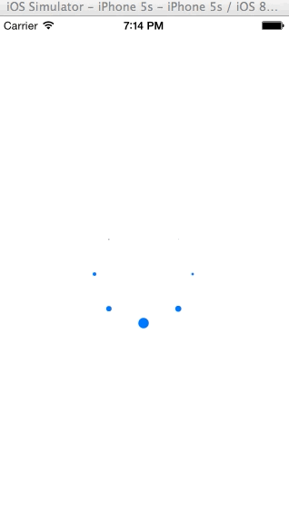

FGProgressHUD
=============

FGProgressHUD是一个用于iOS平台的等待界面，具有使用简单的特点。效果如下图所示：



实现的过程中或多或少的参考了以下开源项目：

* [MBProgressHUD](https://github.com/jdg/MBProgressHUD)

* [SVProgressHUD](https://github.com/samvermette/SVProgressHUD)


##Requirements

* iOS 4.3 +

* Automatic Reference Counting (ARC)
 

##Usage

* 包含文件
	主文件为`FGProgressHUD.h`和`FGProgressHUD.m`。将上述文件包含到你的工程中即可。
	
* 调用接口
	提供了四个对外接口：
```objective-c
+ (void)show;
+ (void)showWithMaskType:(FGProgressHUDMaskType)maskType;

+ (void)dismiss;

+ (BOOL)isVisible;

```	

* 类型
	共有三种类型：
```objective-c
typedef NS_ENUM(NSUInteger,FGProgressHUDMaskType) {
    FGProgressHUDMaskTypeNone = 1, // allow user interactions while HUD is displayed
    FGProgressHUDMaskTypeClear, // don't allow user interactions, it's the default value
    FGProgressHUDMaskTypeBlack, // don't allow user interactions and dim the UI in the back of the HUD
};
```

	其中，`FGProgressHUDMaskTypeNone`允许和HUD后面的界面交互，其余两个不允许交互；
	`FGProgressHUDMaskTypeBlack`会显示带黑色背景，其余两个背景为透明色；
	默认值是`FGProgressHUDMaskTypeClear`。


##License

本项目遵守 [MIT license](https://github.com/wangzz/FGProgressHUD/blob/master/LICENSE)

